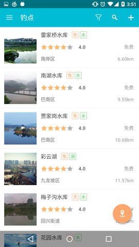

##FitSystemWindowLayout
自动适应StatusBar与NavigationBar的Layout。  
原理：根据你的配置自动设置基于StatusBar与NavigationBar的padding。 
方便的建立类似这样的APP

自动处理4.4以下，4.4，5.0以上及有无虚拟按键以及横屏竖屏的各种复合情况下的布局(好累...)
## 依赖
`compile 'com.jude:fitsystemwindowlayout:2.1.2'`  
## XML配置
在value中的styles.xml中设置

    <!-- Base application theme. -->
    
    
    
在value-v19中的styles.xml中设置

    
    
在value-v21中的styles.xml中设置

    

然后使用AppTheme这个主题，这是1个示例，应该看得出来吧。只要在你的AppTheme的v19版本和v21版本添加了相应属性就好。

## 使用
在根节点使用
`FitSystemWindowsFrameLayout`  
`FitSystemWindowsLinearLayout`  
`FitSystemWindowsRelativeLayout`  
就像：

    <com.jude.fitsystemwindowlayout.FitSystemWindowsLinearLayout
        xmlns:android="http://schemas.android.com/apk/res/android"
        android:orientation="vertical"
        android:layout_width="match_parent"
        android:layout_height="match_parent"
        android:background="@color/white">
    
        <include layout="@layout/include_toolbar"/>
        <FrameLayout
            android:layout_width="match_parent"
            android:layout_height="match_parent">
        </FrameLayout>
        
    </com.jude.fitsystemwindowlayout.FitSystemWindowsLinearLayout>
    
## 3个基本属性
3种Layout都有这3个基本属性。

    app:padding_status="false"//默认为true
    app:padding_navigation="true"//默认为false
    app:status_color="#567890"//默认为colorPrimary
    
    `padding_status`会自动增加StatusBar的位置的Padding，颜色默认是主题里的`ColorPrimary`；  
    `padding_navigation`会自动增加NavigationBar位置的Padding。  
    
    默认效果是不能使用StatusBar的位置，可以使用NavigationBar的位置。
    
## 对子View的单独属性配置
对每个自己直接子View指定属性：(LinearLayout无效，都明白..)

    app:margin_status="false"
    app:margin_navigation="true"
这2个属性优先级比基本属性高。可以对每个View指定与StatusBar和NavigationBar的关系。
例：

	<com.jude.fitsystemwindowlayout.FitSystemWindowsFrameLayout
	    xmlns:android="http://schemas.android.com/apk/res/android"
	    xmlns:app="http://schemas.android.com/apk/res-auto"
	    xmlns:tools="http://schemas.android.com/tools"
	    android:layout_width="match_parent"
	    android:layout_height="match_parent"
	    app:padding_status="false"//不自动腾出StatusBar的空间，为了让图片在StatusBar下绘制
	    tools:context="com.jude.demo.MainActivity">
	
	    <android.support.v7.widget.Toolbar
	        android:id="@+id/toolbar"
	        android:layout_width="match_parent"
	        android:layout_height="wrap_content"
	        android:minHeight="?actionBarSize"
	        android:background="#0000"//透明ToolBar
	        app:theme="@style/AppTheme.Dark"
	        app:margin_status="true"//让ToolBar去适应StatusBar
	        />
	
	    <android.support.design.widget.FloatingActionButton
	        android:id="@+id/fab"
	        android:layout_width="wrap_content"
	        android:layout_height="wrap_content"
	        android:layout_gravity="bottom|end"
	        android:layout_margin="@dimen/fab_margin"
	        app:margin_navigation="true"//让FAB去适应NavigationBar
	        android:src="@android:drawable/ic_dialog_email" />
	
	</com.jude.fitsystemwindowlayout.FitSystemWindowsFrameLayout>

## 可滑动View的内Padding处理
如果可滑动View的最后一个View这样显示。  
  
那就没办法点击了。需要给它加一个内Padding。  
所以可以给可滑动View添加这个属性(给需要的子View加)  
`app:padding_navigation="true"`  
就像这样：

	<ScrollView
	        android:layout_width="match_parent"
	        android:layout_height="match_parent"
	        app:padding_navigation="true"
	        />
或者适用`com.jude.fitsystemwindowlayout.Utils.paddingToNavigationBar(view)`
这个属性只适用于可滑动View(ListView,RecyclerView,ScrollView等)。其他View无效。  

**详见demo**
License
-------

    Copyright 2016 Jude

    Licensed under the Apache License, Version 2.0 (the "License");
    you may not use this file except in compliance with the License.
    You may obtain a copy of the License at

       http://www.apache.org/licenses/LICENSE-2.0

    Unless required by applicable law or agreed to in writing, software
    distributed under the License is distributed on an "AS IS" BASIS,
    WITHOUT WARRANTIES OR CONDITIONS OF ANY KIND, either express or implied.
    See the License for the specific language governing permissions and
    limitations under the License.

    
